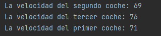
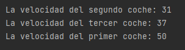
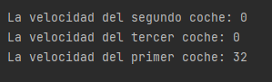

## 1. Explica qué hace el método Main.
El método main es el que se encarga de ejecutar cualquier programa, es el que se conoce como el punto de entrada de al aplicación java.  
## 2. Poniendo un punto de ruptura en la línea 27 del método main.
Las velocidades de los tres coche comienza en 0 (puesto que están parados), después de la primera aceleración, se les atribuirá un número aleatorio que cómo máximo, será de 80. He hecho la prueba de qué número saldría en cada aceleración y este es el resultado.  
  
## 3. Poniendo un punto de ruptura en la línea 46 del método main.
En este punto, se vuelve a sacar la velocidad nueva, que llegará hasta un máximo de 100, pero esta velocidad se utilizará para frenar el vehículo, restando el resultado de la nueva velocidad a la velocidad anteriormente utilizada. En este caso me han dado varios resultados, siempre menor a la velocidad de aceleración de antes, siendo en algunos casos, de 0.
A continuación pongo dos ejemplos:  
    